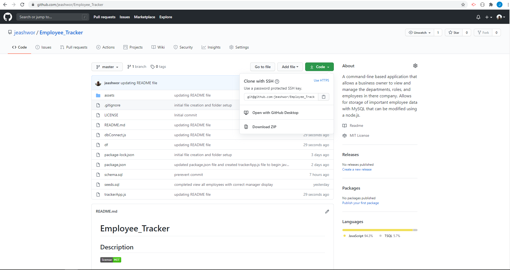
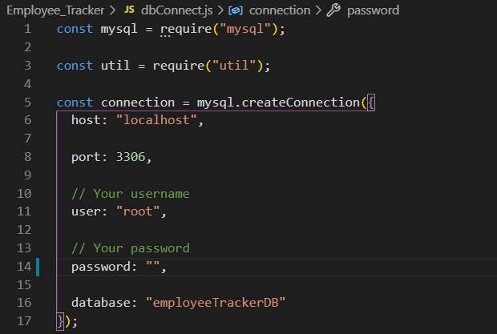
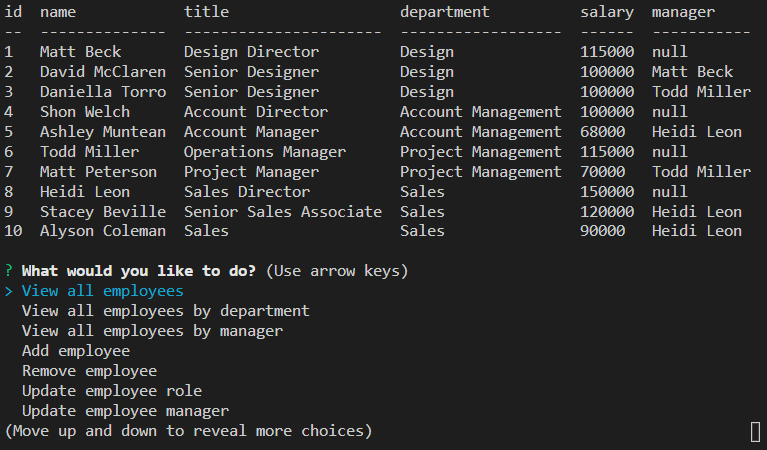

# Employee_Tracker

## Description  

  
A command-line based application that allows a business owner to view and manage the departments, roles, and employees in there company.  Allows for storage of important employee data with MySQL that can be modified using a node.js.
  


<br>
<br>
<br>
  
## Table of Contents  
  
* [Installation](installation-instructions)  
* [Usage](#usage-instructions)  
* [License](#license)  
* [Questions](#questions)

<br>
<br>
<br>
  
## Installation Instructions  

* Follow [Link](https://github.com/jeashwor/Employee_Tracker) to application GitHub repository.

* Locate Green "Code" button and select the clipboard to copy repo data.

* 

* Using your preferred terminal application navigate to your desired location to copy the repository folder using the git clone command along with the info copied from the GitHub page in the above step.

*  With in the terminal navigate to the newly cloned folder and if you have MySQL command line application installed on your machine the following command can be used to login in, and then create the created database using the provided schema.sql and seeds.sql files.  Otherwise use your preferred method of communicating with the MySQL database.

    ```
    mysql -u root -p
    ```
    ```
    source schema.sql
    source seeds.sql
    ```


*  No exit MySQL command line app by typing quit, and then run an npm install command to install necessary modules.

    ```
    npm i
    ```

* Now open the dbConnect.js file and enter your username and password in the areas depicted below.

    

* Now you are now ready to run the application!

    

<br>
<br>
<br>

## Usage Instructions  

*  See full walk through of application at this [link](https://drive.google.com/file/d/1eRlv1WdLZxfFup4PfElRCwgRXlCBl6BK/view)

* Application can be called from your command line in the README_Generator file directory using the following command:

    ```
    node index.js
    ```
    or
    ```
    npm run start
    ```

* Application will open and give the following actions that can be performed with the database created. 

    *  "View all employees"
    *  "View all employees sorted by department"
    *  "View all employees sorted by manager"
    *  "Add employee"
    *  "Remove employee"
    *  "Update employee role"
    *  "Update employee manager"
    *  "View role"
    *  "Add role"
    *  "Remove role"
        *  Note: Will remove all employees with this role!
    *  "View department"
    *  "Add department"
    *  "Remove department"
        *  Note: Will remove all roles and employees with this department!
    *  "Exit application"

<br>
<br>
<br>

## License

* Application licensed under MIT.  For more information see [license document](./utils/license.md).
  
<br>
<br>
<br>

## Questions

Check out my GitHub page here:  [jeashwor's Page](https://github.com/jeashwor)

If you have additional questions please email me at jeashwor@gmail.com
